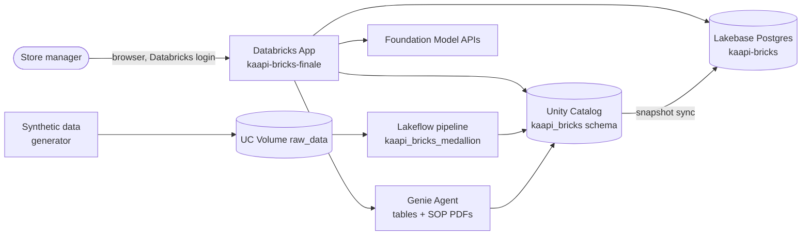
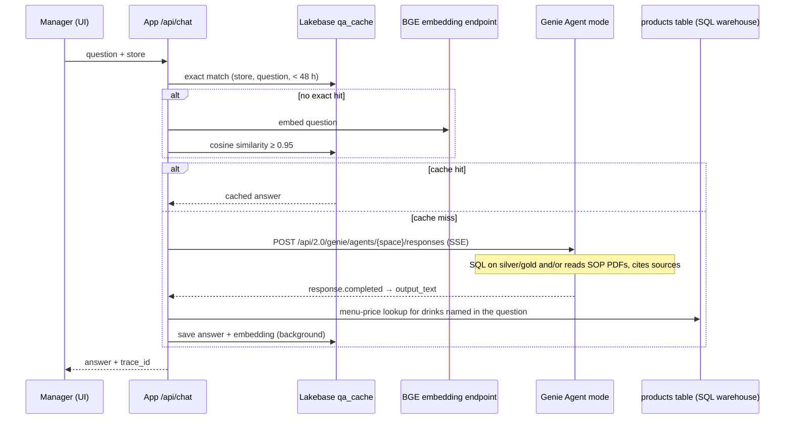
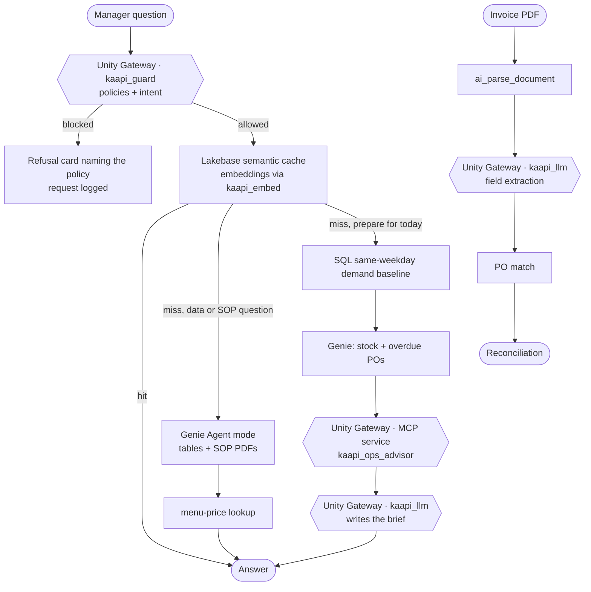

# Kaapi Bricks — Architecture

Detailed architecture of the Kaapi Bricks store-operations assistant: what is deployed today,
how each request flows, who is allowed to do what, and what is planned next.

**Status legend:** ✅ built and verified (evidence file cited) · 🟡 planned, not built yet ·
⚠️ known limitation.
Last updated 2026-09-29. Identifiers that are internal to the workspace (hosts, app URLs,
service-principal IDs) are deliberately left out of this document.

---

## 1. Context

A Kaapi Bricks store manager (a fictional 37-store South-Indian filter-coffee chain) uses one app to:

1. check a supplier invoice against the purchase order before paying it,
2. see stock levels and late deliveries for the store,
3. ask questions answered from company data (sales, stock, suppliers) **and** company documents
   (recipes, SOPs, food safety, supplier agreements).



Everything runs in one Databricks workspace on serverless compute, and one Unity Catalog schema,
`fevm_cme_conde_catalog.kaapi_bricks`, holds all data and AI assets.

---

## 2. Component inventory

| Plane | Component | What it is | Status | Evidence |
|---|---|---|---|---|
| Data | `scripts/generate_data.py` | Faker (seed 42): 37 stores, 28 products, 22 ingredients, 8 suppliers, 15k customers, 200k orders, 2k POs, 3,493 PO lines, 171k inventory txns | ✅ | 01 |
| Data | UC Volume `raw_data/<entity>/` | One Parquet folder per entity, plus `ka_documents/` (6 SOP PDFs) | ✅ | 01, 02 |
| Data | Lakeflow `kaapi_bricks_medallion` | Serverless, triggered, SQL; 14 bronze + 14 silver + 7 gold | ✅ ran, update 065d6a70 | 01, 03 |
| Data | App-write tables | `app_inventory_receipts`, `app_po_approvals` (Delta, outside the pipeline) | ✅ | 02 |
| Serving | Lakebase instance `kaapi-bricks` | 4 `lb_*` business tables + `kaapi_mcp.*` app memory | ✅ | 04, 07 |
| Serving | `scripts/sync_gold_to_lakebase.py` | Truncate-and-reload of gold → Lakebase; grants the app SP `SELECT` | ✅ manual run | 04 |
| Intelligence | Genie Agent (space `01f12a63…`) | 21 silver + gold tables + the `raw_data/` volume (SOP PDFs), Agent mode API | ✅ | 05, 08, 09 |
| Intelligence | Invoice reconciliation | `ai_parse_document` → Claude Sonnet 4.6 extraction → PO / line matching | ✅ | 06 |
| Intelligence | Menu-price lookup | Appends `products.base_price` for drinks named in the question | ✅ | 09 (run 5) |
| Intelligence | Semantic answer cache | Exact match, then BGE embedding similarity ≥ 0.95, 48 h TTL, per store | ✅ | code |
| Intelligence | MCP ops advisor `kaapi-ops-mcp` | Tool `operations_advisor`: live weather (Open-Meteo) + 2026 holiday calendar + LLM plan | ✅ deployed · ⚠️ **not called** | — |
| App | `apps/main-chat-app` | FastAPI backend + single-page React UI | ✅ ACTIVE | 07 |
| Quality | `scripts/run_genie_evaluation.py` | MLflow eval of Genie directly (serverless job) | ✅ runs 1–3 | 09 |
| Quality | `scripts/run_app_evaluation.py` | MLflow eval of the **deployed app** end to end | ✅ run 5 | 09 |
| Governance | Unity Catalog grants, lineage, comments | App SP granted directly, not through groups | ✅ | 02, 07 |
| Governance | AI Gateway (serving endpoints) | Usage tracking only, on the Claude and BGE endpoints | ✅ passive | — |
| Governance | **Unity Gateway services** | Governed model + MCP services, policies, rate limits, request logs | 🟡 planned (§9) | — |

---

## 3. Data plane: from raw files to governed tables

```
generate_data.py ──► /Volumes/…/kaapi_bricks/raw_data/<entity>/<entity>.parquet
                              │  Auto Loader: FROM STREAM read_files(..., format => 'parquet')
                              ▼
BRONZE  14 streaming tables   bronze_<entity>  = raw columns + _source_file + _ingested_at
                              │  materialized views, CAST + QUALIFY ROW_NUMBER() dedup
                              ▼
SILVER  14 materialized views  stores, products, toppings, ingredients, suppliers, promotions,
                               customers, orders, order_items, order_item_toppings,
                               purchase_orders, po_line_items, inventory_transactions,
                               promotion_redemptions
                               45 expectations (DROP ROW for keys/ranges, WARN for soft rules)
                              │
                              ▼
GOLD     7 materialized views
  gold_store_daily_kpis      store × day: orders, revenue, discounts, refunds, AOV     3,693
  gold_inventory_position    store × ingredient stock, below_reorder, days_cover          814
                             (silver inventory_transactions UNION app_inventory_receipts)
  gold_open_purchase_orders  pending POs minus app_po_approvals, is_overdue              147
  gold_delivery_exceptions   late or cancelled POs, days_late                             339
  gold_product_demand        store × product × day units + 28-day rolling average     85,710
  gold_supplier_performance  fill rate, on-time rate, average days late                     8
  gold_waste_summary         waste quantity and cost per store × ingredient               810
```

| Property | Value |
|---|---|
| Definition | `databricks.yml` + `resources/kaapi_pipeline.pipeline.yml` + `src/pipeline/0{1,2,3}_*.sql` (Asset Bundle) |
| Compute | Serverless, `continuous: false` (triggered) |
| Last full run | 2026-09-27, ~61 s, 35/35 flows completed (evidence/01) |
| Data quality | 45 constraints, 0 failed, read from `event_log()` (evidence/03) |
| Data range | Orders 2026-02-01 → 2026-05-14 (200k-order cap); POs and inventory → 2026-07-31 |
| Naming rule | Silver keeps business names so Genie and the app need no aliases; `bronze_` and `gold_` prefixes |

**Write-path rule.** Silver and gold are pipeline-owned and read-only. The app writes approvals
only to `app_inventory_receipts` and `app_po_approvals`, and gold unions those in, so an approval
appears in gold after the next pipeline refresh.

---

## 4. Serving plane: Lakebase

| Schema.table | Rows | Source | Read by |
|---|---:|---|---|
| `lb_inventory_position` | 814 | gold_inventory_position | UI inventory panel via `GET /api/lakebase/inventory/{store}` |
| `lb_open_purchase_orders` | 147 | gold_open_purchase_orders | (available for panels) |
| `lb_delivery_exceptions` | 339 | gold_delivery_exceptions | (available for panels) |
| `lb_product_demand` | 6,324 | gold_product_demand, last 7 days of data | (available for panels) |
| `kaapi_mcp.conversations`, `messages` | — | app writes | chat history |
| `kaapi_mcp.feedback` | — | app writes | 👍/👎 with MLflow trace ID |
| `kaapi_mcp.qa_cache` | — | app writes | semantic answer cache (question, answer, embedding, store, latency) |

**Why Lakebase and not Delta for these:** they are small, per-store point lookups made on every
screen load. Lakebase answers them at OLTP latency. Multi-store analytics stays on Delta through Genie.

⚠️ **Freshness:** `lb_*` tables change only when the pipeline runs and
`sync_gold_to_lakebase.py` is run after it. An approved invoice therefore does not move the
Lakebase stock number until the next sync (planned fix: write-through, §9).

---

## 5. Application: API surface

| Route | Purpose | Reads | Writes |
|---|---|---|---|
| `POST /api/chat` | Chat (SSE, single final event) | Lakebase cache → Genie Agent → `products` | Lakebase messages and cache; Delta `inference_logs`; MLflow trace |
| `POST /api/parse-invoice` | Upload and reconcile an invoice | UC Volume `invoices/`, `suppliers`, `purchase_orders`, `po_line_items` | the uploaded file in the volume |
| `POST /api/approve-invoice` | Manager approves reconciled lines | — | `app_inventory_receipts`, `app_po_approvals` |
| `GET /api/lakebase/inventory/{store}` | Inventory panel (UI uses this) | Lakebase `lb_inventory_position` | — |
| `GET /api/inventory/{store}` | Same data from Delta gold (backup path) | `gold_inventory_position` | — |
| `GET /api/conversations…`, `POST …/clear` | Chat history | Lakebase | Lakebase |
| `POST /api/feedback` | 👍/👎 on an answer | — | Lakebase `feedback` |
| `GET /api/stores`, `/api/examples`, `/api/stats`, `/api/cached/{i}` | UI metadata and demo shortcuts | app config, Lakebase | — |

`POST /api/chat` accepts `skip_cache: true`, which the evaluation uses to force a fresh answer.
The final SSE event includes `trace_id` so any answer can be traced in MLflow.

---

## 6. Request flows as deployed today

### 6.1 Chat question



MLflow spans per request: `chat_request` (AGENT) → `genie_call` (CHAT_MODEL) → `menu_price_lookup`
(TOOL). Example trace `tr-054b71b6d16076a7ba3b5e0008342e81`: 42.7 s, of which 40.0 s was Genie
(evidence/08).

### 6.2 Invoice reconciliation

```mermaid
sequenceDiagram
    participant U as Manager (UI)
    participant A as App
    participant V as UC Volume invoices/
    participant W as SQL warehouse
    participant L as Claude Sonnet 4.6 endpoint
    U->>A: POST /api/parse-invoice (PDF)
    A->>V: upload file
    A->>W: ai_parse_document(content) → text elements
    A->>L: extract JSON (supplier, invoice no., PO ref, lines, totals)
    A->>W: match supplier; fetch PO by reference
    alt PO belongs to another supplier
        A->>A: warning "reference ignored"; fall back to supplier + store open PO
    end
    A->>W: fetch po_line_items; compare each line
    A-->>U: per line: match / price (error) / quantity (warning) / extra / missing
    U->>A: POST /api/approve-invoice
    A->>W: INSERT app_inventory_receipts, app_po_approvals
```

Measured (evidence/06): PO-01057 invoice, 4 planted discrepancies + 1 control line → all 4
detected, control matched, 22.7 s server time. The capture found and fixed two defects: the
missing-delivery check that never fired, and the unchecked supplier on the PO reference.

### 6.3 End-to-end record trace

PO-00006 traced raw Parquet → bronze → silver → gold → Lakebase → app answer, with the same
values at every layer (evidence/08).

---

## 7. Identity and permissions

Two identities exist in a Databricks App, and all app calls use the **app service principal**:

| | App service principal | Signed-in user |
|---|---|---|
| Used for | UC, SQL warehouse, Lakebase, Genie, model endpoints | Login to the app only |
| Gets custom OAuth scopes (e.g. `ai-gateway`) | yes, once configured | no (Databricks Apps does not mint them) |

Grants held by the app service principal (granted directly, not through a group):

| Asset | Grant |
|---|---|
| Catalog `fevm_cme_conde_catalog` | `USE CATALOG` |
| Schema `kaapi_bricks` | `USE SCHEMA`, `SELECT`, `MODIFY` ⚠️ (schema-wide; production should narrow to the 2 app-write tables) |
| Volumes `raw_data`, `invoices` | `READ VOLUME`; `WRITE VOLUME` on `invoices` |
| SQL warehouse | `CAN_USE` (app resource) |
| Genie space | `CAN_EDIT` (app resource) |
| Serving endpoints | `CAN_QUERY` on Claude Sonnet 4.6 and BGE (app resources) |
| Lakebase | Postgres login role + `SELECT` on `lb_*` (granted by the sync script) + ownership of `kaapi_mcp.*` |
| MCP app `kaapi-ops-mcp` | `CAN_MANAGE` |

⚠️ **Cleanup items found on 2026-09-29:**
- The live app still lists the retired MAS and KA endpoints as resources. `apps deploy` updates
  code, not the app's resource list.
- `app.yaml` declares five model endpoints the code never calls (Llama, GPT, Gemini, Maverick,
  AI-Days).
- `user_api_scopes` is empty; the `ai-gateway` scope must be added for §9.

---

## 8. Quality and observability

| Signal | Where | What it proves |
|---|---|---|
| Pipeline event log | `event_log(<pipeline id>)` | flow completion, row counts, per-constraint pass/fail (evidence/01, 03) |
| MLflow traces | experiment `3268449285627906` | every chat request with span timings; `trace_id` returned to the UI |
| MLflow evaluation | experiment `982411422225142` | 5 runs on 10 questions / 32 expected facts (evidence/09) |
| `inference_logs` (Delta) | `kaapi_bricks.inference_logs` | query, response summary, latency, errors per chat request |
| Serving usage | `system.serving` usage tables | token usage on the Claude and BGE endpoints (usage tracking on) |

Evaluation history (evidence/09):

| Run | System under test | Correctness | Relevance | Safety |
|---|---|---:|---:|---:|
| 1 | Genie, Chat mode (cannot read documents) | 0.00 | 0.30 | 1.00 |
| 2 | Genie, Agent mode | 0.50 | 1.00 | 1.00 |
| 3 | + completeness instruction | 0.50 | 1.00 | 1.00 |
| 4 | Deployed app | void (9/10 scored) | — | — |
| **5** | **Deployed app + menu-price lookup** | **0.70** | **1.00** | **1.00** |

---

## 9. Target architecture: Unity Gateway in front of all AI calls 🟡

Planned and approved in principle, **not built yet**. It follows the `demo-app-factory` plugin's
gateway pattern (`phase-gateway.md`).

### 9.1 Principle

Every AI call from the app enters through **Unity Gateway**, Databricks' governance layer for
models and MCP servers, built on Unity Catalog. Services are UC objects: callers need `EXECUTE`,
and each call is policy-checked, rate-limited, logged to a Delta table and cost-attributed in
system tables.

### 9.2 Services to create (in `fevm_cme_conde_catalog.kaapi_bricks`)

| Service | Type | Routes to | Lane | Used for |
|---|---|---|---|---|
| `kaapi_guard` | model service | Claude Haiku 4.5 | **strict**: jailbreak, unsafe-content and customer-PII policies | Screens every chat question and classifies its intent |
| `kaapi_llm` | model service | Claude Sonnet 4.6, with a fallback model | **working**: governed and logged, no blocking policies | Invoice extraction, prep brief, the MCP server's own LLM |
| `kaapi_embed` | model service | BGE-large-en (same model as the cache) | working | Semantic-cache embeddings |
| `kaapi_ops_advisor` | MCP service | existing UC connection `kaapi_ops_mcp` | governed tool | Weather + holiday calendar for preparation plans |

Two LLM lanes because a strict PII policy must not break legitimate work (the app handles
customer and supplier names). The embedding service must wrap the **same** model as the cache,
or cached embeddings silently stop matching.

### 9.3 Target request flow



The guard runs **before** the cache, so a cached answer can never bypass a policy.

### 9.4 How it will be wired

| Item | Setting |
|---|---|
| Call surface | `POST {workspace}/ai-gateway/mlflow/v1/chat/completions` and `/embeddings`, with `model` = the 3-level UC name |
| Identity | App service principal token with the `ai-gateway` scope (`databricks apps update … user_api_scopes`, then restart) |
| Grants | `EXECUTE` on each service to the app SP; `USE CONNECTION` on `kaapi_ops_mcp` |
| Rate limits | `config.rate_limits` via CLI (default: 60/min per user, 300/min for the app) |
| Request logs | `config.inference_table` via CLI, one Delta table per service in `kaapi_bricks` |
| Policies | **UI-only**: built-in jailbreak + unsafe-content, plus custom UC SQL function `kaapi_customer_pii` |
| App flags | `APP_GW_ROUTE_LLM`, `APP_GW_ROUTE_EMBED` default off; **no silent fallback** around the gateway |
| Blocked calls | HTTP 400 with the policy name; the app renders answer / blocked / approval / error states |

### 9.5 What stays outside the gateway

- `ai_parse_document`: a built-in SQL function that runs inside the warehouse. It is governed by UC
  and billed in system tables, but it is not a model API call. The extraction step after it goes
  through `kaapi_llm`.
- Genie's own internal model calls are managed by Genie. The question still enters through
  `kaapi_guard` first.
- The MCP server's call to the Open-Meteo weather API is made inside the MCP server. The gateway
  governs the MCP tool call, not the HTTP request behind it.

### 9.6 Other planned changes 🟡

| Change | Why |
|---|---|
| Lakebase write-through on invoice approval | The inventory panel updates the moment the manager approves |
| Prep-plan path (weekday baseline + Genie + MCP + LLM) | Fixes the "prepare for today" answer: it used one Thursday instead of the Monday average, and had no weather |
| Remove stale app resources and unused endpoints | Least privilege; accurate resource list |
| Narrow `MODIFY` to the two app-write tables | Least privilege |
| Schedule sync after the pipeline (job task) or use Lakebase synced tables | Removes the manual sync step |

---

## 10. Design decisions and trade-offs

- **One Genie Agent instead of Knowledge Assistant + Supervisor Agent.** KA and SA are being
  deprecated in favour of Genie Agents; one agent now covers table and document questions.
- **Agent mode, not Chat mode.** Chat mode only sees tables (eval run 1: Correctness 0.00). Agent
  mode reads the PDF volume, at a cost of ~23–40 s per uncached answer.
- **Structured facts from tables, not the model.** Eval run 3 showed a prompt instruction does
  not make the model reliably include menu prices; a deterministic lookup against
  `products.base_price` does (run 5).
- **Deterministic gold, LLM on top.** Stock, open POs and delivery exceptions are SQL; the model
  explains, it does not compute.
- **The system compares, the manager decides.** Invoice reconciliation never writes on its own;
  approval is an explicit human step.
- **Guard rails fail loudly.** A PO reference from another supplier is rejected with a
  warning, not reconciled silently. The planned gateway integration has no fallback that skips
  governance.
- **Lakebase for per-store point lookups, Delta and Genie for analytics.**
- **Measure the product, not a component.** The headline evaluation (run 5) calls the deployed
  app, with the cache skipped, rather than Genie alone.

---

## 11. Known limits

| Limit | Impact | Plan |
|---|---|---|
| ⚠️ Lakebase freshness depends on a manual sync | approval not visible in the panel until the next sync | write-through (§9.6) |
| ⚠️ MCP ops advisor not called | no weather or holiday input to preparation advice | prep path via the MCP service (§9) |
| ⚠️ Agent mode latency 23–40 s uncached | slow first answer | semantic cache; guard adds ~1–2 s |
| ⚠️ Correctness 0.70 on 10 questions | below the 0.80 target; ±0.1–0.2 run-to-run variation | 30+ question set, must-have / nice-to-have rubric |
| ⚠️ Synthetic data ends May/July 2026 | "today" questions are answered from older data, and the answer says so | regenerate through the current date after submission |
| ⚠️ Invoice fallback store is hard-coded to STR-001 | multi-store invoices need a store mapping | map store name → id |
| ⚠️ Header totals not reconciled | synthetic `purchase_orders.total_amount` is independent of line items | line-level reconciliation only |

---

## 12. Evidence map

| File | Proves |
|---|---|
| `evidence/01_lakeflow_run.txt` | pipeline run, row counts per layer |
| `evidence/02_uc_tables_and_lineage.md` | table inventory and lineage |
| `evidence/03_data_quality_results.txt` | 45 expectations from the event log |
| `evidence/04_lakebase_queries.txt` | Lakebase tables, counts, sample queries |
| `evidence/05_genie_questions_and_answers.md` | Genie SQL answers checked against the data |
| `evidence/06_genai_model_outputs.md` + `raw/06_*` | captured invoice runs and preparation answer |
| `evidence/07_app_health_and_api_tests.txt` | app status and authenticated API responses |
| `evidence/08_end_to_end_record_trace.md` + `raw/08_*` | PO-00006 raw → app, with MLflow trace |
| `evidence/09_mlflow_evaluation_results.md` | 5 evaluation runs, per-question results |
| `evidence/10_business_kpi_calculations.md` | value assumptions and formulas |
