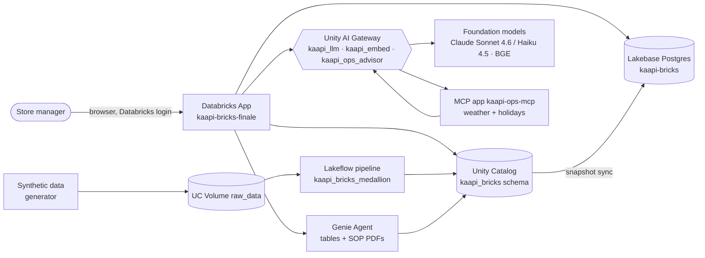
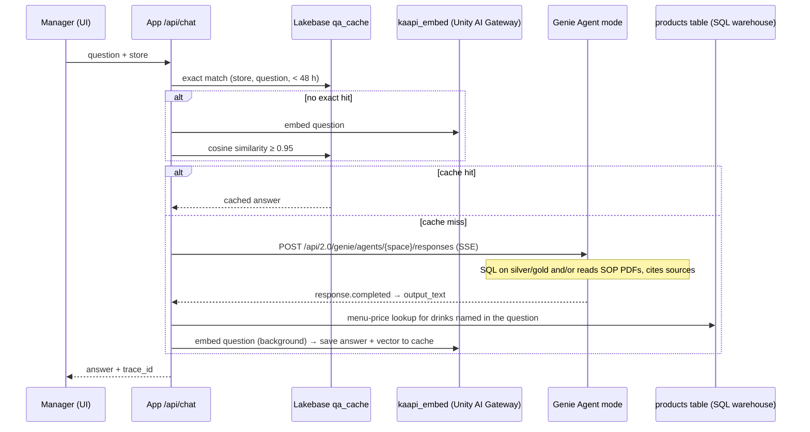
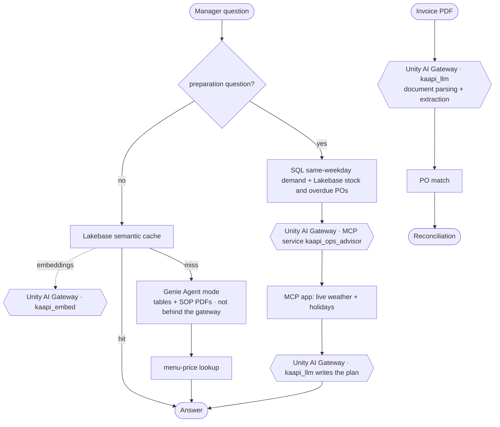

# Kaapi Bricks — Architecture

Detailed architecture of the Kaapi Bricks store-operations assistant: what is deployed today,
how each request flows, who is allowed to do what, and what is planned next.

**Status legend:** ✅ built and verified (evidence file cited) · 🟡 planned, not built yet ·
⚠️ known limitation.
Last updated 2026-09-29. Identifiers that are internal to the workspace (hosts, app URLs,
service-principal IDs) are deliberately left out of this document.

---

## 1. Context

A Kaapi Bricks store manager (a fictional 37-store South-Indian filter-coffee chain) uses one app to:

1. check a supplier invoice against the purchase order before paying it,
2. see stock levels and late deliveries for the store,
3. ask questions answered from company data (sales, stock, suppliers) **and** company documents
   (recipes, SOPs, food safety, supplier agreements),
4. get a daily preparation plan that combines sales history, stock and live weather.



Everything runs in one Databricks workspace on serverless compute, and one Unity Catalog schema,
`fevm_cme_conde_catalog.kaapi_bricks`, holds all data and AI assets, including the gateway services.
**Every AI call except Genie goes through Unity AI Gateway** (§9).

---

## 2. Component inventory

| Plane | Component | What it is | Status | Evidence |
|---|---|---|---|---|
| Data | `scripts/generate_data.py` | Faker (seed 42): 37 stores, 28 products, 22 ingredients, 8 suppliers, 15k customers, 200k orders, 2k POs, 3,493 PO lines, 171k inventory txns | ✅ | 01 |
| Data | UC Volume `raw_data/<entity>/` | One Parquet folder per entity, plus `ka_documents/` (6 SOP PDFs) | ✅ | 01, 02 |
| Data | Lakeflow `kaapi_bricks_medallion` | Serverless, triggered, SQL; 14 bronze + 14 silver + 7 gold | ✅ ran, update 065d6a70 | 01, 03 |
| Data | App-write tables | `app_inventory_receipts`, `app_po_approvals` (Delta, outside the pipeline) | ✅ | 02 |
| Serving | Lakebase instance `kaapi-bricks` | 4 `lb_*` business tables + `kaapi_mcp.*` app memory | ✅ | 04, 07, 11 |
| Serving | `scripts/sync_gold_to_lakebase.py` | Truncate-and-reload of gold → Lakebase; grants the app SP `SELECT` | ✅ manual run | 04 |
| Intelligence | Genie Agent (space `01f12a63…`) | 21 silver + gold tables + the `raw_data/` volume (SOP PDFs), Agent mode API | ✅ | 05, 08, 09 |
| Intelligence | Invoice reconciliation | PDF → `kaapi_llm` document parsing + field extraction (one gateway call) → PO / line matching | ✅ | 06, 11 |
| Intelligence | Preparation plan | Same-weekday demand (SQL on gold) + stock and overdue POs (Lakebase) → MCP service → plan written by `kaapi_llm` | ✅ | 11 |
| Intelligence | Menu-price lookup | Appends `products.base_price` for drinks named in the question | ✅ | 09 (run 5) |
| Intelligence | Semantic answer cache | Exact match, then embedding similarity ≥ 0.95 (embeddings via `kaapi_embed`), 48 h TTL, per store | ✅ | 11 |
| Intelligence | MCP ops advisor `kaapi-ops-mcp` | Tool `operations_advisor`: live weather (Open-Meteo) + 2026 holiday calendar + plan; called through MCP service `kaapi_ops_advisor`; its own LLM call goes through `kaapi_llm` | ✅ | 11 |
| App | `apps/main-chat-app` | FastAPI backend + single-page React UI | ✅ ACTIVE | 07 |
| Quality | `scripts/run_genie_evaluation.py` | MLflow eval of Genie directly (serverless job) | ✅ runs 1–3 | 09 |
| Quality | `scripts/run_app_evaluation.py` | MLflow eval of the **deployed app** end to end | ✅ run 5 | 09 |
| Governance | Unity Catalog grants, lineage, comments | App SP granted directly, not through groups | ✅ | 02, 07 |
| Governance | **Unity AI Gateway services** | `kaapi_llm`, `kaapi_embed`, `kaapi_ops_advisor`: `EXECUTE` grants, service-wide rate limits, payload logs | ✅ | 11 |
| Governance | Gateway policies / guardrails and `kaapi_guard` strict lane | Question-level policies in front of Genie | 🟡 not built (§9.6) | — |

---

## 3. Data plane: from raw files to governed tables

```
generate_data.py ──► /Volumes/…/kaapi_bricks/raw_data/<entity>/<entity>.parquet
                              │  Auto Loader: FROM STREAM read_files(..., format => 'parquet')
                              ▼
BRONZE  14 streaming tables   bronze_<entity>  = raw columns + _source_file + _ingested_at
                              │  materialized views, CAST + QUALIFY ROW_NUMBER() dedup
                              ▼
SILVER  14 materialized views  stores, products, toppings, ingredients, suppliers, promotions,
                               customers, orders, order_items, order_item_toppings,
                               purchase_orders, po_line_items, inventory_transactions,
                               promotion_redemptions
                               45 expectations (DROP ROW for keys/ranges, WARN for soft rules)
                              │
                              ▼
GOLD     7 materialized views
  gold_store_daily_kpis      store × day: orders, revenue, discounts, refunds, AOV     3,693
  gold_inventory_position    store × ingredient stock, below_reorder, days_cover          814
                             (silver inventory_transactions UNION app_inventory_receipts)
  gold_open_purchase_orders  pending POs minus app_po_approvals, is_overdue              147
  gold_delivery_exceptions   late or cancelled POs, days_late                             339
  gold_product_demand        store × product × day units + 28-day rolling average     85,710
  gold_supplier_performance  fill rate, on-time rate, average days late                     8
  gold_waste_summary         waste quantity and cost per store × ingredient               810
```

| Property | Value |
|---|---|
| Definition | `databricks.yml` + `resources/kaapi_pipeline.pipeline.yml` + `src/pipeline/0{1,2,3}_*.sql` (Asset Bundle) |
| Compute | Serverless, `continuous: false` (triggered) |
| Last full run | 2026-09-27, ~61 s, 35/35 flows completed (evidence/01) |
| Data quality | 45 constraints, 0 failed, read from `event_log()` (evidence/03) |
| Data range | Orders 2026-02-01 → 2026-05-14 (200k-order cap); POs and inventory → 2026-07-31 |
| Naming rule | Silver keeps business names so Genie and the app need no aliases; `bronze_` and `gold_` prefixes |

**Write-path rule.** Silver and gold are pipeline-owned and read-only. The app writes approvals
only to `app_inventory_receipts` and `app_po_approvals`, and gold unions those in, so an approval
appears in gold after the next pipeline refresh.

---

## 4. Serving plane: Lakebase

**Instance:** `kaapi-bricks` · Postgres 16 · capacity CU_1 · database `databricks_postgres`.
Row counts below were read from the live instance on 2026-09-29.

Lakebase plays **two different roles** in this system.

### 4.1 Role A: operational serving of gold business data

A read-optimized **copy** of four gold tables, for per-store point lookups at OLTP latency. Delta
stays the system of record.

| Table (`public`) | Rows | Copied from | Read by | Used? |
|---|---:|---|---|---|
| `lb_inventory_position` | 814 | `gold_inventory_position` | UI inventory panel (`GET /api/lakebase/inventory/{store}`), and the preparation plan's lowest-stock-cover lines | ✅ |
| `lb_open_purchase_orders` | 147 | `gold_open_purchase_orders` | preparation plan's overdue-PO lines | ✅ |
| `lb_delivery_exceptions` | 339 | `gold_delivery_exceptions` | nothing in the app today | ⚠️ synced, unused |
| `lb_product_demand` | 6,324 | `gold_product_demand` (last 7 days of data) | nothing in the app today | ⚠️ synced, unused |

Delivery-exception and demand answers come from Genie (over gold) or from SQL on gold (the
preparation plan's weekday baseline needs the full history, which the 7-day Lakebase copy does
not hold). The two unused tables are candidates for a new UI panel or for removal from the sync.

**How data gets there:** `scripts/sync_gold_to_lakebase.py`, run after the pipeline.
1. `CREATE TABLE IF NOT EXISTS` for the four `lb_*` tables.
2. `GRANT SELECT` on them to the app service principal, looked up from the app name.
3. For each table: read the gold view through the SQL warehouse, `TRUNCATE`, then insert all rows.

This is a snapshot: simple, and correct for a demo. The last sync ran 2026-09-28T13:59:57Z.

### 4.2 Role B: the app's own transactional state

Tables the app creates and writes itself (`init_db()` on start-up), in schema `kaapi_mcp`:

| Table | Rows | Written by | Read by | Purpose |
|---|---:|---|---|---|
| `conversations` | 133 | first message of each chat | `GET /api/conversations` | chat history list |
| `messages` | 646 | every user question and every answer (with MLflow `trace_id`) | `GET /api/conversations/{id}/messages` | chat transcript |
| `feedback` | 1 | `POST /api/feedback` (👍/👎 + `trace_id`) | `GET /api/stats` | ties user feedback to an MLflow trace |
| `qa_cache` | 5 | after each fresh non-preparation answer: question, answer, 1024-dim embedding (via `kaapi_embed`), store, latency | every chat request: exact match, then cosine ≥ 0.95, same store, < 48 h | semantic answer cache; cut a repeat answer from 25.3 s to 1.1 s (evidence/11) |
| `compare_cache` | 0 | nothing | nothing | ⚠️ leftover from the retired model-compare feature |
| `admin_config` | 1 | seeded on start-up | nothing | ⚠️ leftover (`operations_model` setting) |

Expired cache rows (older than 48 h) are deleted on start-up. Preparation-plan answers are never
written to `qa_cache`, because they depend on today's weather.

### 4.3 How the app connects

| Aspect | Implementation |
|---|---|
| Identity | the app service principal; its client ID is the Postgres role name |
| Credential | short-lived OAuth token from `generate_database_credential`, refreshed after 50 minutes; no password is stored |
| Driver | `psycopg` 3, TLS (`sslmode=require`), autocommit |
| Connection | one shared connection with a `SELECT 1` health check; on failure the token is refreshed and it reconnects |
| Failure handling | chat-history and cache failures are caught and logged, so the chat still answers; the preparation plan says "stock and purchase-order status unavailable" if Lakebase is down |
| Declared as | app resource `lakebase` (`CAN_CONNECT_AND_CREATE`) |

### 4.4 Why Lakebase and not Delta for these

- **Point lookups on every screen load.** "Stock for store STR-001" is a single-key read. Postgres
  answers it at OLTP latency, whereas a SQL-warehouse query on Delta has query-start overhead.
- **Small, hot, per-store data.** Hundreds of rows per table, read far more often than written.
- **Transactional app state.** Chat history, feedback and the cache are row-at-a-time writes with
  foreign keys (messages → conversations), a natural fit for Postgres and a poor one for Delta.
- **Analytics stays on Delta.** Multi-store and historical questions go to Genie over gold, and
  the demand baseline uses SQL on gold, because Lakebase only holds the last 7 days of demand.

### 4.5 Limits

- ⚠️ **Freshness:** `lb_*` tables change only when the pipeline runs and the sync is run after
  it. An approved invoice therefore does not move the Lakebase stock number until the next sync
  (planned fix: write-through on approval, §9.6).
- ⚠️ Two synced tables and two app tables are unused (see above).
- ⚠️ Production would use Lakebase synced tables, or a scheduled job task after the pipeline,
  instead of the manual truncate-and-reload script.

---

## 5. Application: API surface

| Route | Purpose | Reads | Writes |
|---|---|---|---|
| `POST /api/chat` | Chat (SSE, single final event) | preparation questions: SQL on gold + Lakebase + MCP service; other questions: Lakebase cache → Genie Agent → `products` | Lakebase messages and cache (embeddings via `kaapi_embed`); Delta `inference_logs`; MLflow trace |
| `POST /api/parse-invoice` | Upload and reconcile an invoice | `kaapi_llm` (document parsing), `suppliers`, `purchase_orders`, `po_line_items` | the uploaded file in the `invoices/` volume |
| `POST /api/approve-invoice` | Manager approves reconciled lines | — | `app_inventory_receipts`, `app_po_approvals` |
| `GET /api/lakebase/inventory/{store}` | Inventory panel (UI uses this) | Lakebase `lb_inventory_position` | — |
| `GET /api/inventory/{store}` | Same data from Delta gold (backup path) | `gold_inventory_position` | — |
| `GET /api/conversations…`, `POST …/clear` | Chat history | Lakebase | Lakebase |
| `POST /api/feedback` | 👍/👎 on an answer | — | Lakebase `feedback` |
| `GET /api/stores`, `/api/examples`, `/api/stats`, `/api/cached/{i}` | UI metadata and demo shortcuts | app config, Lakebase | — |

`POST /api/chat` accepts `skip_cache: true`, which the evaluation uses to force a fresh answer.
The final SSE event includes `trace_id` so any answer can be traced in MLflow.

---

## 6. Request flows as deployed today

### 6.1 Chat question (non-preparation)

Questions that match the preparation pattern ("prepare", "prep", "plan … today/tomorrow") are
routed to §6.3 **before** the cache. Everything else follows this path.



MLflow spans per request: `chat_request` (AGENT) → `genie_call` (CHAT_MODEL) → `menu_price_lookup`
(TOOL). Example trace `tr-054b71b6d16076a7ba3b5e0008342e81`: 42.7 s, of which 40.0 s was Genie
(evidence/08). A repeated question is served from the cache in 1.1 s (evidence/11 §4.3).

### 6.2 Invoice reconciliation

```mermaid
sequenceDiagram
    participant U as Manager (UI)
    participant A as App
    participant V as UC Volume invoices/
    participant L as kaapi_llm (Unity AI Gateway)
    participant W as SQL warehouse
    U->>A: POST /api/parse-invoice (PDF)
    A->>V: upload file (audit copy)
    A->>L: chat/completions with the PDF as a "document" block
    Note over L: parse + extract JSON in one governed call<br/>(supplier, invoice no., PO ref, lines, totals)
    A->>W: match supplier; fetch PO by reference
    alt PO belongs to another supplier
        A->>A: warning "reference ignored"; fall back to supplier + store open PO
    end
    A->>W: fetch po_line_items; compare each line
    A-->>U: per line: match / price (error) / quantity (warning) / extra / missing
    U->>A: POST /api/approve-invoice
    A->>W: INSERT app_inventory_receipts, app_po_approvals
```

Measured through the gateway (evidence/11 §4.1): PO-01057 invoice, 4 planted discrepancies +
1 control line → all 4 detected, control matched, **18.4 s** server time. The earlier path
(`ai_parse_document` + a separate LLM call, evidence/06) took 22.7 s and is no longer used.

### 6.3 Preparation plan ("How should I prepare for today?")

```mermaid
sequenceDiagram
    participant U as Manager (UI)
    participant A as App /api/chat
    participant W as SQL warehouse (gold)
    participant LB as Lakebase
    participant M as MCP service kaapi_ops_advisor (Unity AI Gateway)
    participant O as MCP app kaapi-ops-mcp
    participant L as kaapi_llm (Unity AI Gateway)
    U->>A: "How should I prepare for today?" + store
    Note over A: preparation question → bypasses cache and Genie
    A->>W: same-weekday demand per drink + typical orders/revenue
    A->>LB: lowest stock cover; overdue POs
    A->>M: JSON-RPC tools/call operations_advisor(query, store, store_data)
    M->>O: forwards (connection signs in as kaapi-mcp-connector-v2)
    O->>O: live weather (Open-Meteo) + 2026 holiday calendar
    O->>L: write the plan (as the MCP app SP)
    L-->>O: plan
    O-->>A: plan text
    A-->>U: plan + "store data used" block (not cached)
```

Trace `tr-aaeed4886214ffedd824fdd23513d5e7` (evidence/11 §4.2), 36.2 s: `chat_request` →
`prep_brief` → `prep_store_data` (8.1 s) → `mcp_ops_advisor` (28.1 s). The plan used live
weather (thunderstorm, 21 mm) and the Tuesday baseline (Classic Filter Coffee 12.1), which
matches an independent query.

### 6.4 End-to-end record trace

PO-00006 traced raw Parquet → bronze → silver → gold → Lakebase → app answer, with the same
values at every layer (evidence/08).

---

## 7. Identity and permissions

Two identities exist in a Databricks App, and all app calls use the **app service principal**:

| | App service principal | Signed-in user |
|---|---|---|
| Used for | UC, SQL warehouse, Lakebase, Genie, Unity AI Gateway | Login to the app only |
| Gets custom OAuth scopes (`ai-gateway`) | yes: `user_api_scopes` set on both apps | no (Databricks Apps does not mint them) |

Grants held by the **main app** service principal (granted directly, not through a group):

| Asset | Grant |
|---|---|
| Catalog `fevm_cme_conde_catalog` | `USE CATALOG` |
| Schema `kaapi_bricks` | `USE SCHEMA`, `SELECT`, `MODIFY` ⚠️ (schema-wide; production should narrow to the 2 app-write tables) |
| Volumes `raw_data`, `invoices` | `READ VOLUME`; `WRITE VOLUME` on `invoices` |
| SQL warehouse | `CAN_USE` (app resource) |
| Genie space | `CAN_EDIT` (app resource) |
| Unity AI Gateway | `EXECUTE` on `kaapi_llm`, `kaapi_embed`, `kaapi_ops_advisor` |
| Lakebase | Postgres login role + `SELECT` on `lb_*` (granted by the sync script) + ownership of `kaapi_mcp.*` |
| MCP app `kaapi-ops-mcp` | `CAN_MANAGE` |

Other principals:

| Principal | Grant | Why |
|---|---|---|
| MCP app service principal | `EXECUTE` on `kaapi_llm` | the advisor's own LLM call goes through the gateway |
| Connector SP `kaapi-mcp-connector-v2` | `CAN_USE` on the MCP app | the UC connection `kaapi_ops_mcp` signs in as this SP (OAuth M2M; secret rotated 2026-09-29, 90-day lifetime) |

The main app now declares only three resources (Genie space, Lakebase, SQL warehouse). The retired
KA/MAS endpoints and five unused model endpoints were removed from the live app on 2026-09-29.

---

## 8. Quality and observability

| Signal | Where | What it proves |
|---|---|---|
| Pipeline event log | `event_log(<pipeline id>)` | flow completion, row counts, per-constraint pass/fail (evidence/01, 03) |
| MLflow traces | experiment `3268449285627906` | every chat request with span timings; `trace_id` returned to the UI |
| MLflow evaluation | experiment `982411422225142` | 5 runs on 10 questions / 32 expected facts (evidence/09) |
| `inference_logs` (Delta) | `kaapi_bricks.inference_logs` | query, response summary, latency, errors per chat request |
| **Gateway payload logs** | `kaapi_bricks.kaapi_llm_payload`, `kaapi_embed_payload` | every governed model call: time, status, latency, destination, requester (main app SP vs MCP app SP), full request/response (evidence/11) |
| Gateway / MCP usage | system tables | MCP service calls (MCP services have no payload-log table) and token usage |

Evaluation history (evidence/09):

| Run | System under test | Correctness | Relevance | Safety |
|---|---|---:|---:|---:|
| 1 | Genie, Chat mode (cannot read documents) | 0.00 | 0.30 | 1.00 |
| 2 | Genie, Agent mode | 0.50 | 1.00 | 1.00 |
| 3 | + completeness instruction | 0.50 | 1.00 | 1.00 |
| 4 | Deployed app | void (9/10 scored) | — | — |
| **5** | **Deployed app + menu-price lookup** | **0.70** | **1.00** | **1.00** |

---

## 9. Unity AI Gateway: every non-Genie AI call is governed ✅

Built 2026-09-29, following the `demo-app-factory` plugin's gateway pattern (`phase-gateway.md`).
Evidence: `evidence/11_unity_ai_gateway.md`.

### 9.1 Principle

Unity AI Gateway is Databricks' governance layer for models and MCP servers, built on Unity
Catalog. Services are UC objects: callers need `EXECUTE`, and each call is rate-limited, logged
and attributed in system tables. The app routes **every AI call except Genie** through it and has
no fallback to an ungoverned path: a gateway error surfaces as an error.

### 9.2 Services (in `fevm_cme_conde_catalog.kaapi_bricks`)

| Service | Type | Routes to | Rate limit | Request log | Used for | Status |
|---|---|---|---|---|---|---|
| `kaapi_llm` | model service | Claude Sonnet 4.6 → fallback Claude Haiku 4.5 | 300/min | `kaapi_llm_payload` | Invoice document parsing + extraction, the MCP advisor's plan | ✅ |
| `kaapi_embed` | model service | BGE-large-en v1.5 (same vectors as before: cosine 1.000000) | 600/min | `kaapi_embed_payload` | Semantic-cache embeddings | ✅ |
| `kaapi_ops_advisor` | MCP service | UC connection `kaapi_ops_mcp` → MCP app | 120/min | system tables | Weather + holiday preparation advice | ✅ |
| `kaapi_guard` | model service, strict lane | Claude Haiku 4.5 + policies | — | — | Question-level policies before Genie | 🟡 not built (user kept Genie questions off the gateway) |

Rate limits are service-wide (`RATE_LIMIT_KEY_SERVICE`, per minute). All app traffic reaches the
gateway as the app service principal, so a per-user limit would not differentiate store managers.
Enforcement was verified: at 1 request/min, 2 of 4 calls got **HTTP 429 `REQUEST_LIMIT_EXCEEDED`**
(evidence/11 §4.4); the limit was restored to 300.

### 9.3 As-built flow



### 9.4 Wiring

| Item | Setting |
|---|---|
| Call surface | `POST {workspace}/ai-gateway/mlflow/v1/chat/completions` and `/embeddings` (`model` = 3-level UC name); `POST {workspace}/ai-gateway/mcp-services/<catalog>.<schema>.<service>` (JSON-RPC) |
| Document input | PDF sent as `{"type":"document","source":{"type":"base64","media_type":"application/pdf",…}}` |
| Identity | App service principal token; `ai-gateway` in both apps' `user_api_scopes` (set with `databricks apps update`, applied on redeploy) |
| Grants | `EXECUTE` per service (§7) |
| Config | `create-model-service` / `create-mcp-service`; `update-model-service … config.rate_limits`, `config.inference_table`; `update-mcp-service … config.rate_limits` |
| App config | `GW_LLM_MODEL`, `GW_EMBED_MODEL`, `GW_MCP_SERVICE` in `app.yaml`; MCP app `GW_LLM_MODEL` |

### 9.5 What stays outside the gateway

| Item | Why |
|---|---|
| Genie Agent calls | By design. Governed by the Genie space and Unity Catalog permissions |
| The MCP server's HTTP call to the Open-Meteo weather API | Made inside the MCP server's code. The gateway governs the MCP tool call, not the HTTP request behind it |
| The MCP app's admin "compare models" UI | Demo tool that calls serving endpoints directly. Not used by the store-manager flows |
| MLflow evaluation judges | Evaluation tooling, not app traffic |

`ai_parse_document` is no longer used: document parsing now goes through `kaapi_llm`.

### 9.6 Remaining planned changes 🟡

| Change | Why |
|---|---|
| Gateway policies (UI-only): built-in jailbreak / unsafe-content on `kaapi_llm`; optional `kaapi_guard` strict lane for question-level policies | Guardrails; policy refusal demo beat |
| Lakebase write-through on invoice approval | The inventory panel updates the moment the manager approves |
| Use or drop `lb_delivery_exceptions` / `lb_product_demand`; remove the unused `compare_cache` / `admin_config` tables | Every synced or created Lakebase table has a reader |
| Narrow `MODIFY` to the two app-write tables | Least privilege |
| Schedule the sync after the pipeline (job task) or use Lakebase synced tables | Removes the manual sync step |
| Cost-per-store query on gateway usage system tables | Replaces the assumed AI cost with a measured one |
| Delete the connector SP's older secret (2026-07-07) if unused | Credential hygiene |

---

## 10. Design decisions and trade-offs

- **One Genie Agent instead of Knowledge Assistant + Supervisor Agent.** KA and SA are being
  deprecated in favour of Genie Agents; one agent now covers table and document questions.
- **Agent mode, not Chat mode.** Chat mode only sees tables (eval run 1: Correctness 0.00). Agent
  mode reads the PDF volume, at a cost of ~23–40 s per uncached answer.
- **Every non-Genie AI call through Unity AI Gateway, no ungoverned fallback.** Access, limits and
  logs live in Unity Catalog next to the data. The only fallback (Sonnet → Haiku) is inside the gateway.
- **Document parsing as one governed model call.** Sending the PDF to `kaapi_llm` replaced
  `ai_parse_document` + a separate extraction call. It was faster (18.4 s vs 22.7 s server) and
  gave the same reconciliation result.
- **Structured facts from tables, not the model.** Eval run 3 showed a prompt instruction does
  not make the model reliably include menu prices; a deterministic lookup against
  `products.base_price` does (run 5). The preparation plan applies the same rule: the demand
  baseline and stock come from SQL and Lakebase, and the model only writes the plan.
- **Deterministic gold, LLM on top.** Stock, open POs and delivery exceptions are SQL; the model
  explains, it does not compute.
- **The system compares, the manager decides.** Invoice reconciliation never writes on its own;
  approval is an explicit human step.
- **Guard rails fail loudly.** A PO reference from another supplier is rejected with a warning,
  not reconciled silently.
- **Lakebase for per-store point lookups, Delta and Genie for analytics.**
- **Measure the product, not a component.** The headline evaluation (run 5) calls the deployed
  app, with the cache skipped, rather than Genie alone.

---

## 11. Known limits

| Limit | Impact | Plan |
|---|---|---|
| ⚠️ Lakebase freshness depends on a manual sync | approval not visible in the panel until the next sync | write-through (§9.6) |
| ⚠️ Agent mode latency 23–40 s uncached; preparation plan ~36 s | slow first answer | semantic cache for Q&A; preparation plans are deliberately not cached (weather changes) |
| ⚠️ Gateway rate-limit changes take >20 s to propagate | a limit change is not instant | observed in evidence/11 §4.4; plan changes ahead of demos |
| ⚠️ No gateway policies attached yet | no content guardrails on model calls | attach in the UI (§9.6) |
| ⚠️ Correctness 0.70 on 10 questions | below the 0.80 target; ±0.1–0.2 run-to-run variation | 30+ question set, must-have / nice-to-have rubric |
| ⚠️ Synthetic data ends May/July 2026 | "today" answers use older sales history, and the answer says so | regenerate through the current date after submission |
| ⚠️ Invoice fallback store is hard-coded to STR-001 | multi-store invoices need a store mapping | map store name → id |
| ⚠️ Header totals not reconciled | synthetic `purchase_orders.total_amount` is independent of line items | line-level reconciliation only |

Resolved on 2026-09-29: the MCP ops advisor was not called (now called through the gateway); the
app declared stale and unused resources (removed); `user_api_scopes` was empty (now includes `ai-gateway`).

---

## 12. Evidence map

| File | Proves |
|---|---|
| `evidence/01_lakeflow_run.txt` | pipeline run, row counts per layer |
| `evidence/02_uc_tables_and_lineage.md` | table inventory and lineage |
| `evidence/03_data_quality_results.txt` | 45 expectations from the event log |
| `evidence/04_lakebase_queries.txt` | Lakebase tables, counts, sample queries |
| `evidence/05_genie_questions_and_answers.md` | Genie SQL answers checked against the data |
| `evidence/06_genai_model_outputs.md` + `raw/06_*` | captured invoice runs and preparation answer (pre-gateway path) |
| `evidence/07_app_health_and_api_tests.txt` | app status and authenticated API responses |
| `evidence/08_end_to_end_record_trace.md` + `raw/08_*` | PO-00006 raw → app, with MLflow trace |
| `evidence/09_mlflow_evaluation_results.md` | 5 evaluation runs, per-question results |
| `evidence/10_business_kpi_calculations.md` | value assumptions and formulas |
| `evidence/11_unity_ai_gateway.md` + `raw/11_*` | gateway services, grants, invoice / preparation / cache through the gateway, payload logs, a real 429 |
